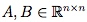

# 线性代数基础知识总结 - Part2
## 4. 向量空间和行列式 
### 4.1 Linear Independence and Rank 线性无关和秩
向量集合  被定义为 **(linearly) independent**，如果其中没有一个向量可以被表示成其余向量的线性组合 **linear combination**。
如果存在这样的线性组合，那么就说这些向量是**linearly dependent**线性相关的。

**column/row rank**：the size of the largest subset of columns/rows of  that constitute a linearly independent set.

对于任意的矩阵A，column rank 和 row rank永远相等，表示为。

rank有以下性质： 

### 4.2 The Inverse 逆矩阵
 
定义：

不是所有的矩阵都存在逆矩阵。如果存在，就是矩阵A是**可逆或者非奇异的(invertible or non-singular)**，否则的话是**不可逆或者奇异的(non-invertible or singular)**。

**方矩阵可逆的充要条件：A必须是full rank的。**

假设都为非奇异矩阵，有性质如下： 

### 4.3 Orthogonal Matrices 正交矩阵

