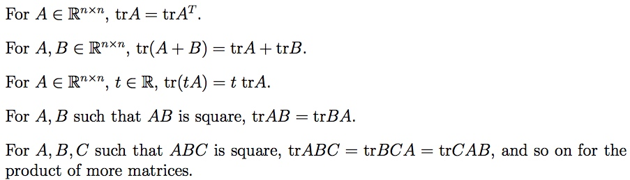
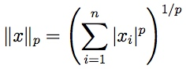

# 线性代数基础知识总结
## 1. 基本的概念和符号
线性代数最直观的理解，一般的多元一次方程组 
 
可以用矩阵表示为 

一般vector表示为**column vector**，**row vector**则表示为 

 
Matrix有三种表示方法： 
 
 
 

## 2. 矩阵乘法
基本定义： 

### 2.1 向量和向量相乘
最常见的**inner product**(dot product)  : 

**outer product**:

### 2.2 矩阵和向量相乘
根据前后位置不同，有两种形式，每种形式可以有两种解释方式（根据矩阵A以列向量表示还是行向量表示）。

比较常见的矩阵在前： 

由此可见，y是矩阵A的列向量的线性组合，组合系数就是向量x的元素。

矩阵在后： 

 
所以，是矩阵A的行向量的线性组合，组合系数是向量x的元素。

### 2.3 矩阵和矩阵相乘
有四种不同的形式。

正如前面定义的一样，最直观的表示为：

也可以表示为不同outer products的和

矩阵和矩阵乘法也可以看成多个矩阵和向量的乘法

### 2.4 矩阵乘法的属性

结合律： 
分配律： 
没有交换律。

在推导一些矩阵乘法式子的时候，比较常用的方式是把矩阵之间的运算表示为标量之间的运算，从而可以利用标量运算的一些特性，比如： 

## 3. 特殊矩阵和矩阵操作
### 3.1 Identity Matrix单位矩阵 和 Diagonal Matrices对角矩阵
**Identity Matrix**： 
定义： 
 
属性：

**Diagonal matrix**:  
定义： 
 
显而易见：

### 3.2 The Transpose 转置
 
定义：

属性： 

### 3.3 Symmetric Matrices 对称矩阵
 
显而易见，对于任意方阵A，是对称的，是反对称的。

进而可以得出，任意方矩阵都可以表示为一个对称矩阵和反对称矩阵的之和： 

对称矩阵在实际应用中，有很多非常有用的特性。

### 3.4 The Trace
其中，A是方矩阵

属性： 

使用[2.4](#24-矩阵乘法的属性)中提到过的相同的方法，把矩阵乘法转换成标量乘法，可以推导这些属性，比如：

### 3.5 Norms范数
最常见的Euclidean(L2 norm)： 
 
所以，

更一般的定义：

其他一些norms： 
: 

: 

最一般的表示： 
 其中， 

Norm也可以定义在矩阵上， ：

